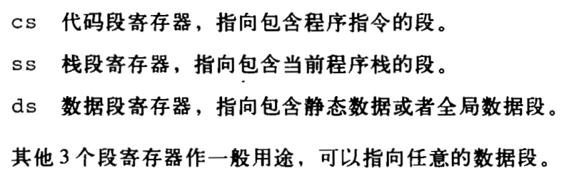
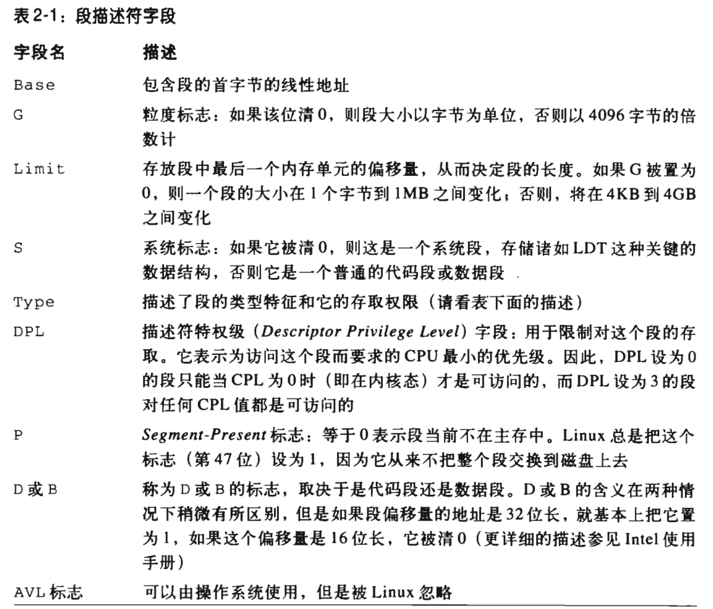

### 段选择符和段寄存器

逻辑地址 = 段标识符 + 段内相对地址偏移量

段标识符：16位，称为段选择符 = [15:3]索引号 + [2]TI表指示器 + [1:0]RPL请求者特权级

偏移量：32位

段寄存器：存放段选择符(cs, ss, ds, es, fs, gs)

### 段描述符字段

段描述符描述了段的特征

GDT: 全局描述符表。GDT在主存中的地址和大小存放在gdtr控制寄存器中

LDT：局部描述符表。当前正被使用的LDT地址和大小放在控制寄存器中 

